# INSTAL·LACIÓ MOODLE

A l'hora de fer l'instal·lació, hi hem de tenir una maquina amb LAMP (Linux, Apache, PHP y MySQL).

Un cop la tenim instal·lada, hi començem a ler l'instal·lació del apche. 
Abans de fer tot aixo per poder copiar del tutorial, ens unirem mijançant ssh a la MV a traves de la maquina real.

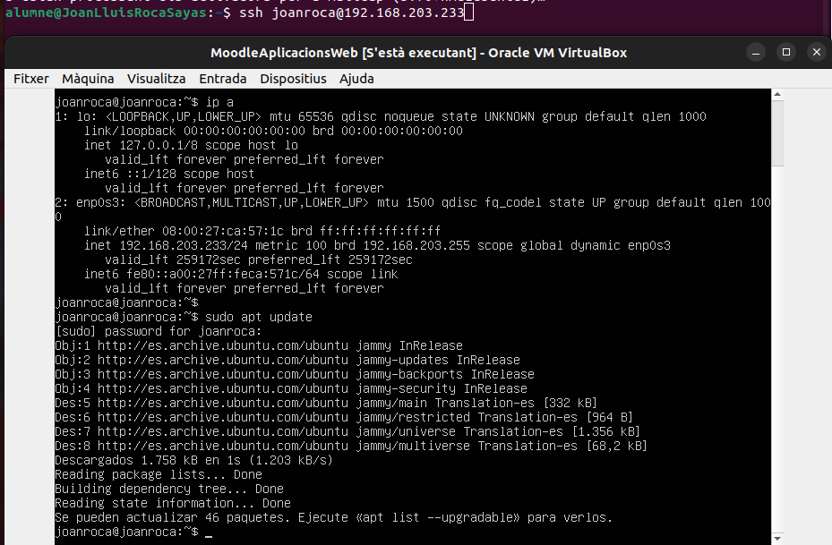

Un cop feta la commanda, ens demanara la contrasenya i l'usuari per a poder accedir a la maquina de manera remota.

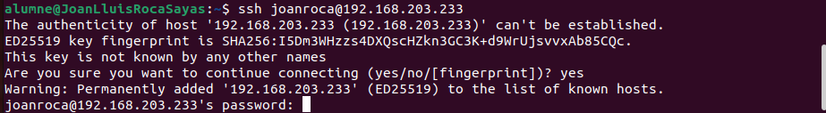

## INSTAL·LACIÓ APACHE

Ara el primer que hi farem hi es instal·lar el apache2.

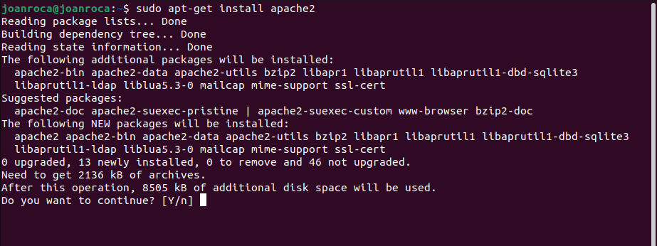

Un cop ho tenim, ja estaria. Ara anirem a instal·lar MariaDB.

## INSTAL·LACIÓ MARIADB

El primer que hi farem es instal·lar la base de dades de mariaDB amb la seguent comanda.

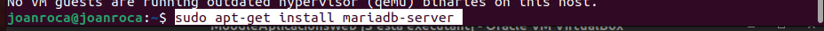

Un cop finalitzat ejecutarem la configuracio del servidor de la base de dades.

I si un cop fet volem accedir a la base de dades ho podem fer amb la seguent comanda.

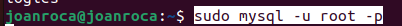

Ara ja el que ens toca es instalar el php.

## INSTAL·LACIÓ DEL PHP

El primer que hi farem es instal·lar les propietats del software.

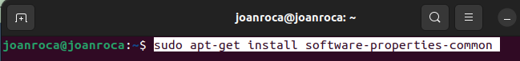

Un cop ho tenim, hi hem d'afegir el repositori.

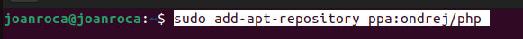

Despres i farem un update per afegir el repositori.

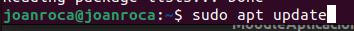

I ja per ultim instal·larem la versió 7.3 del php.

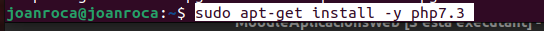

Un cop ho tenim, entrarem dins del seguent fitxer amb la seguent comanda.

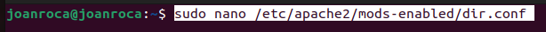

I a dins del fitcher i canviarem la preferencia a llocs acabats en php.

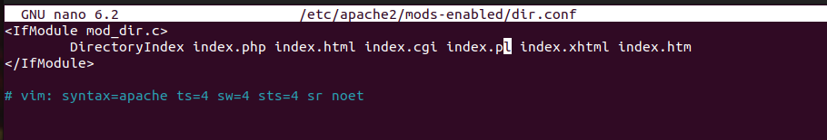

Ara i reiniciarem i comprovarem l'estat d'apache2.

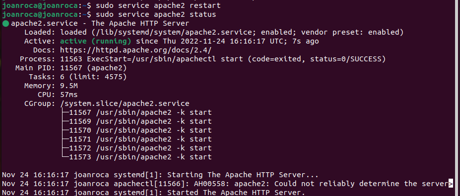

Ara un cop finalitzat tot aixo i hem de anar a instal·lar la versio que necessitem del moodle.

## INSTAL·LACIÓ MOODLE

Per instal·lar el moodle, hi entrem a la seva pagina web dins de descargas i buscarem la versio que volem. hi entrarem i ademes de descargar el zip,
hi hem de copiar l'enllaç a la descarga.

Ara a dins la terminal hi afegirem la seguent commanda per descargar el zip.
Un cop ho tenim, hi tenim que descomprimir l'arxiu.

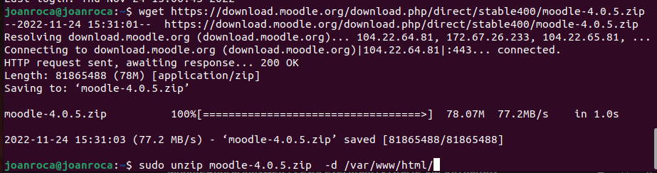

Un cop fet, a la carpeta moodle li hem de canviar els permisos.

Un cop fet, hi crearem una carpeta anomenada moodledata i li canviarem els permisos.

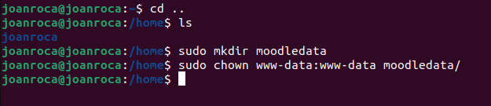

I ja abans de entrar al navegador i buscar per començar a configurar dins de la base de dades, i crearem un usuari amb la contrasenya.

I ja un cop entrem al buscador, hi ens surtira aixo.

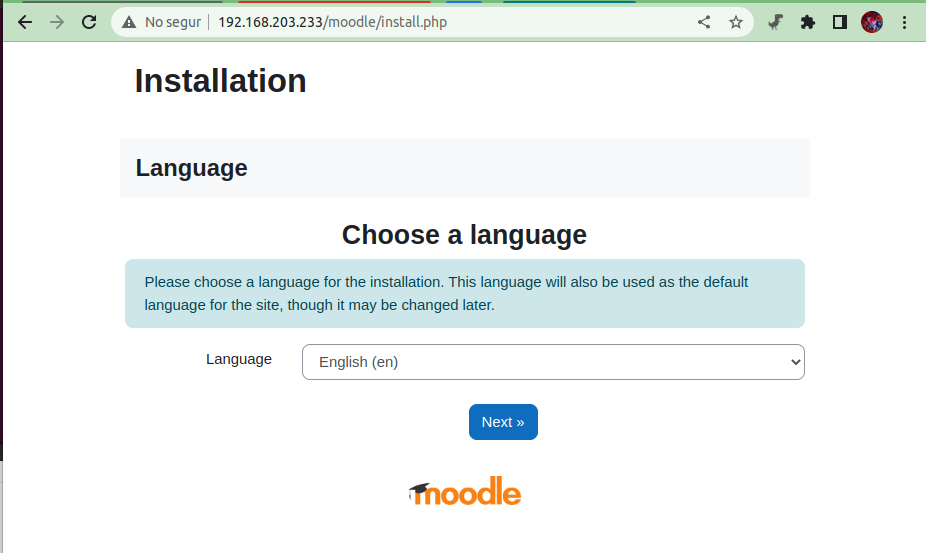

El primer que ens demana es que li diguessim l'idioma que hi volem. En aquest cas en catala.

Al fer seguen, ens sortira aixo.

Per instal·lar el curl, ja que ja hi tenim els repositoris, podem sercar el curl. I intal·lar la versio pertinyent del php curl.

I ara hem de instalar lo zip pertinyent.

Un cop ho tenim hi reiniciem el apache2.

El seguent que ens demana es la URL de moodle, el directori de moodle i el directori de dades de l'usuari.

Un cop posat tot ens demanara qun controlador de base de dades utilitzarem.

Ara el que ens prefuntara es la direccio de la base de dades, el nom de la base de dades i l'usuari i la contrasenya.

Ara al fer seguent, hi he trobat un error.

Per resoldre aixo, anirem a la terminal de la maquina hi farem la seguent comanda.

Per seguir, tindriem que entrar dins del seguent fitxer hi fer els seguent tal com apl fitxer.

Un cop dins i fem un restart.

Ara ens demana que intalesem un paquet.El cual es el seguent.

Per resoldre aixo farem la seguent comanda.

Ara resetegem el apache2.

Ara ens demanara que intalaresem una altra cosa, el cual es el seguent.

Aixi que en la seguent comanda.

I fem el reload.

Ara ja hem surt que s'ha intalat amb exit.

Ara ens sortira una pantalla per a que intalesim i revisesim el seguent.

Ho farem amb la seguent comanda.

I farem un reload al apache2.

I ens quedara aixi i porem continuar.

Continuem i ens sortira aixo.

Un cop continuem aurem de posar una contrasenya.

Un cop ho tenim hem de configurar la pagina de moodle en tituls i descripcions.

I per ultim ja tindrem aixo.

