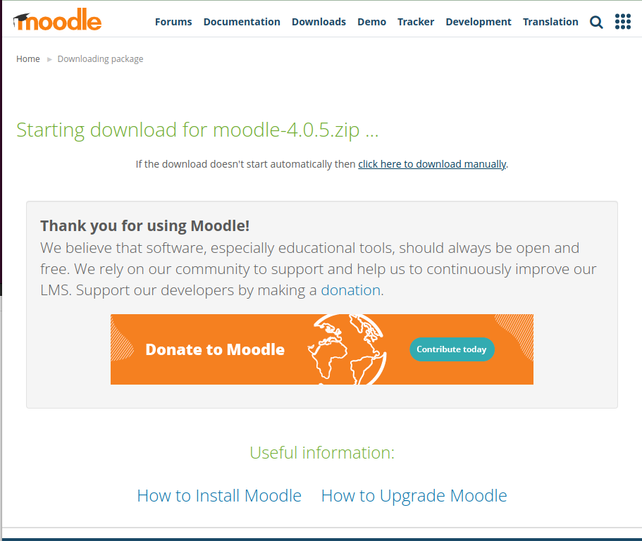

#INSTAL·LACIÓ MOODLE

A l'hora de fer l'instal·lació, hi hem de tenir una maquina amb LAMP (Linux, Apache, PHP y MySQL).

Un cop la tenim instal·lada, hi començem a ler l'instal·lació del apche. 
Abans de fer tot aixo per poder copiar del tutorial, ens unirem mijançant ssh a la MV a traves de la maquina real.

Un cop feta la commanda, ens demanara la contrasenya i l'usuari per a poder accedir a la maquina de manera remota.

##INSTAL·LACIÓ APACHE

Ara el primer que hi farem hi es instal·lar el apache2.

Un cop ho tenim, ja estaria. Ara anirem a instal·lar MariaDB.

##INSTAL·LACIÓ MARIADB

El primer que hi farem es instal·lar la base de dades de mariaDB amb la seguent comanda.

Un cop finalitzat ejecutarem la configuracio del servidor de la base de dades.

I si un cop fet volem accedir a la base de dades ho podem fer amb la seguent comanda.

Ara ja el que ens toca es instalar el php.

##INSTAL·LACIÓ DEL PHP

El primer que hi farem es instal·lar les propietats del software.

Un cop ho tenim, hi hem d'afegir el repositori.

Despres i farem un update per afegir el repositori.

I ja per ultim instal·larem la versió 7.3 del php.

Un cop ho tenim, entrarem dins del seguent fitxer amb la seguent comanda.

I a dins del fitcher i canviarem la preferencia a llocs acabats en php.

Ara i reiniciarem i comprovarem l'estat d'apache2.

Ara un cop finalitzat tot aixo i hem de anar a instal·lar la versio que necessitem del moodle.

##INSTAL·LACIÓ MOODLE

Per instal·lar el moodle, hi entrem a la seva pagina web dins de descargas i buscarem la versio que volem. hi entrarem i ademes de descargar el zip,
hi hem de copiar l'enllaç a la descarga.

Ara a dins la terminal hi afegirem la seguent commanda per descargar el zip.
Un cop ho tenim, hi tenim que descomprimir l'arxiu.

Un cop fet, a la carpeta moodle li hem de canviar els permisos.

Un cop fet, hi crearem una carpeta anomenada moodledata i li canviarem els permisos.

I ja abans de entrar al navegador i buscar per començar a configurar dins de la base de dades, i crearem un usuari amb la contrasenya.

I ja un cop entrem al buscador, hi ens surtira aixo.

El primer que ens demana es que li diguessim l'idioma que hi volem. En aquest cas en catala.

Al fer seguen, ens sortira aixo.

(

Per instal·lar el curl, ja que ja hi tenim els repositoris, podem sercar el curl. I intal·lar la versio pertinyent del php curl.

(
